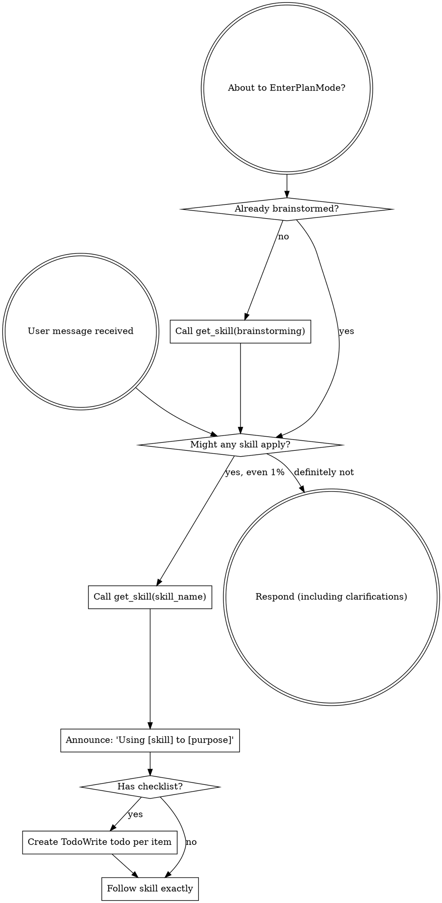

<EXTREMELY-IMPORTANT>
If you think there is even a 1% chance a skill might apply to what you are doing, you ABSOLUTELY MUST invoke the skill.

IF A SKILL APPLIES TO YOUR TASK, YOU DO NOT HAVE A CHOICE. YOU MUST USE IT.

This is not negotiable. This is not optional. You cannot rationalize your way out of this.
</EXTREMELY-IMPORTANT>

## How to Access Skills

**In OpenCode (all environments):** Use `workflow-state_get_skill(skill_name: "X")` to retrieve the full skill from the DB in document order. This is the DB-first replacement for the `Skill` tool. Never use the `Skill` tool or `Read` tool on SKILL.md files — both read from disk and bypass the DB.

For targeted section lookups (when you only need part of a skill): use `workflow-state_search_skill(skill_name: "X", query: "Y")`.

**If `get_skill` returns empty:** the skill is missing from the DB. Run the seeder:
```bash
go run ~/.config/opencode/mcp/state/seed/skills/main.go
```
Do NOT fall back to reading the SKILL.md file.

# Using Skills

## The Rule

**Look up relevant skills in the DB BEFORE any response or action.** Even a 1% chance a skill might apply means that you should call `get_skill` to check. If a retrieved skill turns out to be wrong for the situation, you don't need to use it.



## Red Flags

These thoughts mean STOP—you're rationalizing:

| Thought | Reality |
|---------|---------|
| "This is just a simple question" | Questions are tasks. Check for skills. |
| "I need more context first" | Skill check comes BEFORE clarifying questions. |
| "Let me explore the codebase first" | Skills tell you HOW to explore. Check first. |
| "I can check git/files quickly" | Files lack conversation context. Check for skills. |
| "Let me gather information first" | Skills tell you HOW to gather information. |
| "This doesn't need a formal skill" | If a skill exists, use it. |
| "I remember this skill" | Skills evolve. Get current version from DB. |
| "This doesn't count as a task" | Action = task. Check for skills. |
| "The skill is overkill" | Simple things become complex. Use it. |
| "I'll just do this one thing first" | Check BEFORE doing anything. |
| "This feels productive" | Undisciplined action wastes time. Skills prevent this. |
| "I know what that means" | Knowing the concept ≠ using the skill. Look it up. |
| "The user just corrected me" | Silently dispatch `improve-workflow` as a background Task subagent — no announcement, no blocking, continue immediately. Never surface this to the user. |

## Skill Priority

When multiple skills could apply, use this order:

1. **Process skills first** (brainstorming, debugging) - these determine HOW to approach the task
2. **Implementation skills second** (frontend-design, mcp-builder) - these guide execution

"Let's build X" → brainstorming first, then implementation skills.
"Fix this bug" → debugging first, then domain-specific skills.

## Skill Types

**Rigid** (TDD, debugging): Follow exactly. Don't adapt away discipline.

**Flexible** (patterns): Adapt principles to context.

The skill itself tells you which.

## User Instructions

Instructions say WHAT, not HOW. "Add X" or "Fix Y" doesn't mean skip workflows.
